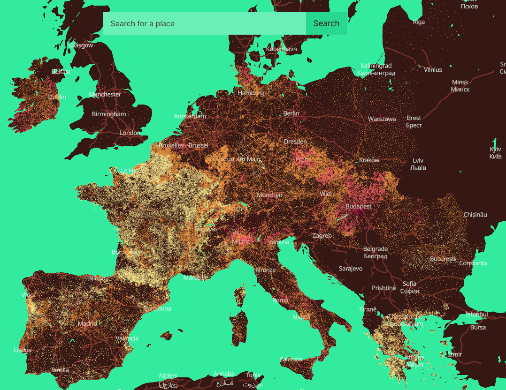

```{r, echo=FALSE}
library(metathis)
meta() %>% 
  meta_description(params$event) %>% 
  meta_name("github-repo" = paste0("datactivist/", params$slug)) %>% 
  meta_viewport() %>% 
  meta_social(
    title = params$title,
    url = paste0("https://datactivist.coop/", params$slug),
    image = params$image,
    image_alt = params$image_alt,
    og_type = "website",
    og_author = "Datactivist",
    og_locale = "fr_FR",
    og_site_name = "Datactivist",
    twitter_card_type = "summary",
    twitter_creator = "@datactivi_st")

```

layout: true

<style>
.remark-slide-number {
  position: inherit;
}

.remark-slide-number .progress-bar-container {
  position: absolute;
  bottom: 0;
  height: 4px;
  display: block;
  left: 0;
  right: 0;
}

.remark-slide-number .progress-bar {
  height: 100%;
  background-color: #e95459;
}

</style>


`r paste0("<div class='my-footer'><span>", params$event, "</span> <center><div class=logo><a href='https://datactivist.coop/'></a></div></center></span></div>")` 


---

class: center, middle

Ces slides en ligne : `r paste0("http://datactivist.coop/", params$slug)`

Sources : `r paste0("https://github.com/datactivist/", params$slug)`


Les productions de Datactivist sont librement réutilisables selon les termes de la licence [Creative Commons 4.0 BY-SA](https://creativecommons.org/licenses/by-sa/4.0/legalcode.fr).

*Le contenu de ces slides proviennent du cours dispensé par Cécile Le Guen ces dernières années. Je la remercie chalheureusement.*

<BR>
<BR>

.reduite[]

---

# Avant toute chose

> Il n'y a pas de question inutile.

--

> Il n'y a que des silence gênant.

---


background-image: url(https://media.giphy.com/media/7zYMzl3AqmkDU7cXa9/giphy.gif)
class: inverse, center, top


# Présentations


---

## Présentation


- Datactivist is a French cooperative company specialized in open data, created in 2016.

- We work throughout the entire lifecycle of data with .red[**both data producers and reusers**] and participate in the appropriation of data by everyone.

- We practice what we preach and contribute to .red[**commons**] : we are a workers co-operative and our productions are freely usable by anyone.

- We believe .red[**research**] can help us better understand and solve the issues we face in the open data field.


---

## À vous !

1. Vous (notamment vous et votre année "hors-les-murs")
2. Votre futur vous
3. Vous et la data
4. Vous et ce cours
5. Vous et ce que vous voulez


---

## Les objectifs de ce cours

**Ce matin**
* Comprendre la place de la data dans les programmes de développement bilatéraux
* Comprendre la place de la data dans les programmes multilatéraux
* Comprendre l'utilité des données ouvertes dans les politiques de développement et la diplomatie
* Découvrir la gouvernance des données autour des données de l'ADP (standard international IATI, portail open data interministériel)

**Cet après-midi**
* Utiliser des données ouvertes pour appuyer une décision ou un plaidoyer
* S'approprier les phases de l'analyse de données : trouver, récupérer, nettoyer, traiter, présenter, etc...
* Effectuer des datavisualisations simples mais utilisables dans de nombreux contexte : cartographie, infographie

---

## Les données, un enjeu de gouvernance


* **Les données, un élément-clé des politiques publiques de gouvernance**

Décentralisation, Fonction publique, Administration électronique, État-civil et identification des personnes, Gouvernement ouvert, ...

* **Les pôles Gouvernance des organisations internationales traitent de sujets liés aux données**

Élaborations des cadres de l'action publique et d'analyses comparatives, dialogue de politique sectorielle avec les autorités nationales et locales compétentes.

* **Les institutions publiques de coopérations internationales sont dans l’obligation de publier leur données de fonctionnement**

**Foreign Aid Transparency and Accountability Act / FATAA** : redevabilité et transparence pour les dépenses liées à l’aide publique au développement. Droit d’accès à l’information pour les ONG et les citoyens.

---

## Les données, un enjeu de développement


* **Départements “Data” crées au sein de tous les organismes de coopération**

Banque Mondiale, OCDE, ONU, mais aussi dans les ONG (TI, Amnesty, Greenpeace,..) ou dans les instances Européennes ( DEVCO, Parlement, Commission) et les bailleurs bilatéraux. (USAID, DFID, GIZ, AFD, SIDA..)

* **La donnée n’est pas un sujet uniquement technique ou statistique**

* **La donnée est devenue un enjeu de développement** 

* **Transports / Images satellites / Innovation économique / Santé / Éducation / Environnement / Urbanisme**

Mais aussi

* **Résilience, Lutte contre la corruption, Prévention des catastrophes, Droits Humains, Participation Citoyenne, Liberté d’expression**


---

class: inverse, center, middle


# Quelques exemples

---

## 1. Sur le thème de la résilience climatique


---

## 2. Sur le thème de la participation citoyenne

---

## 3. Sur le thème de la transparence de l’action publique


---

## 4. Sur le thème de la coopération des média


---

## Deux notions reviennent souvent

---

## En France


---


background-image: url(https://media.giphy.com/media/UTY42CoHu6wixtxTDh/giphy.gif)
class: inverse, center, top


# Pause

---

class: inverse, center, middle


# L'aide au développement est-elle efficace ?

---

## Ce que nous allons apprendre

* Différentes écoles de l’économie de l’Aide au Développement
* Comment mesurer l’efficacité de l’APD ?
* Découvrir le standard IATI et l’initiative portant le projet
* Découvrir les données
* Utiliser les données


---
## Définitions

**Aide publique au développement**

.pull-left[
> *Compte tenu des données de la pratique actuelle des transferts des fonds publics vers les pays sous-développés, la notion d'APD se définit comme un investissement hors marché fondé sur les objectifs que le bailleur de fonds entend poursuivre.* 

[Traore, Lanciné (2022).](https://tel.archives-ouvertes.fr/tel-03642909)

]


.pull-right[
> *L'ADP désigne d'une part un système international de transferts de ressources publiques qui met en contact des pays « donateurs » et des pays « bénéficiaires ». Il renvoie d'autre part à un agrégat statistique précis, objet de débats, conçu dans le but de mesurer l'activité de ce système.*

[Charnoz, Olivier, et Jean-Michel Severino (2015).](https://www.cairn.info/l-aide-publique-au-developpement--9782707182111-p-7.htm)

]

---
## Quelques chiffres

.center[]

.center[[OCED - Compare your country](https://www1.compareyourcountry.org/dev-coop-profiles-2022/en/1/all/default/all/OECD)]


---

## Trois écoles de pensée de l’économie du développement

**Ils et elles ont formulé différentes approches économiques du développement :**

* William Easterly
* Jeffrey Sachs
* Esther Duflo

---

## Les débats de l’économie de l’APD 

* L’APD représente des sommes non négligeables
* L’aide au développement existe depuis les années 50.

Selon William Easterly, elle a représenté une dépense d’environ 2300 milliards de dollars US entre 1950 et 1990. 

--

En 2022, le montant total de l'APD mondiale s'élevait autour de 169 milliards de dollars US. Source : [OCDE](https://www1.compareyourcountry.org/dev-coop-profiles-2022/en/0/4152+4153+4154+4155/default/all/20001) 

→ À partir des années 90, certains commencent à douter de l’efficacité de l’APD

---
## Contexte des années 90 pour l’APD

Les analyses d’évaluation de l’APD étaient alors extrêmement rares. 
On ne se posait pas vraiment la question de l’efficacité de l’aide. 

Changement assez important avec la chute du mur de Berlin et la réorientation des aides vers les pays de l’Est. 
Les premières questions commencent à se poser envers l’efficacité de l’aide aux pays les moins avancés, à travers : 
* L’impact sur l’investissement national 
* L’impact sur la croissance économique
* La réduction des dépenses publiques 

---
## Opposition de 2 figures : deux économistes américains 

1.William Easterly, le sceptique

* Économiste de la banque mondiale de 1985 à 2001
* Spécialiste des économies en voie de développement 
* Professeur à l’université de New-York

2.Jeffrey Sachs, l’optimiste

* Professeur à l’Université de Columbia
* Consultant auprès du secrétaire général de l’ONU
* Soutien intellectuel des grands plans de lutte contre la pauvreté
* Conseiller auprès de la Banque Mondiale, de l’OCDE ou de l’OMS 

---
## William Easterly

.pull-left[

Il pense qu’il ne sert à rien d’investir de l’argent dans des pays qui ont : 
* De mauvaises institutions 
* Dont la gouvernance n’est pas bonne
* Un excès de dépenses publiques 

Entre 1950 et 2001, les pays ayant reçu une aide inférieure à la moyenne ont connu des taux de croissance similaires à ceux qui ont reçu une aide étrangère supérieure à la moyenne. 

]

.pull-right[


[Easterly, William. 2007. The White Man’s Burden. London: Penguin Books.](https://fr.wikipedia.org/wiki/William_Easterly)

]
f
???

=> Des pays pauvres peuvent très bien s’en sortir sans cette aide. 
Exemple : la Corée du Sud. 

=> Ceux qui en ont bénéficié ne s’en sortent pas forcément mieux 

Difficulté à aménager l'aide (concrement`)


---

## Exemples

** Une compilation d'exemples de raté d'aides humanitaires par Sandrine Chastang **

> Dans la région de Kayes, à l’ouest du Mali, arrivent quantité de médicaments envoyés par des associations d’immigrés originaires de la région, qui pensent ainsi aider leurs compatriotes. Or, de nombreux villageois pensent que ces médicaments vendus dans de belles boîtes venues de France sont plus efficaces que les génériques qui leur sont vendus par les centres de santé publique. Il arrive que les malades parcourent des kilomètres et dépensent tout leur revenu pour se procurer ces « belles boîtes », qui correspondent pourtant rarement aux prescriptions du médecin et portent préjudice au fonctionnement des centres de santé du Mali.

[Chastang, Sandrine. 2008. « Toutes les manières de rater un don humanitaire ». Revue du MAUSS 31 (1): 318‑47.](https://doi.org/10.3917/rdm.031.0318.)


---

## Jeffrey Sachs

.pull-left[

Il insiste sur les facteurs qui maintiennent les populations dans les "trappes à pauvreté" : 
* Soins insuffisants
* Malnutrition
* Revenus faibles
* Pas ou peu de formation, d’éducation

Son idée : il faut mener des projets ambitieux pour agir **simultanément** sur toutes les causes de la pauvreté, quelques soient les problèmes de gouvernance sur place. 

]

.pull-right[


[Sachs, Jeffrey. 2005. The end of poverty. New York: Penguin Press.](https://en.wikipedia.org/wiki/The_End_of_Poverty)

]

---
## Jeffrey Sachs

Il décide de mener son propre programme d’aide au développement : 
Millenium Village Project : http://millenniumvillages.org/ 

Objectif : Soutenir le développement d’une quinzaine de villages reculés en Afrique. 
Agir sur tous les facteurs de la pauvreté : donner le coup de _boost_ de départ. 

En 10 ans il a récolté 600 millions de USD$ pour financer son projet (avec des soutiens comme Bono ou Angelina Jolie). 


---

## Nina Munk, une analyse du projet de Jeffrey Sachs 

.pull-left[

Nina Munk, une journaliste a suivi son projet : elle s’est rendue régulièrement dans deux pays en Ouganda et au Kenya pour observer pendant 6 ans ce qu’il s’est passé sur place et suivre le projet de Jeffrey Sachs de près. 
Au Kenya où l’accès à eau question de survie et dans les Zones montagneuses de l’Ouganda. 


]

.pull-right[

Écoutez son intervention dans le cadre du postcast **Splash** - dont s’est très largement inspirée cette première partie ;) 

_Entre 14:45-22:18._

.center[

[Nouvelles Écoutes - Splash](https://nouvellesecoutes.fr/podcast/splash/)
]
]

---

## Esther Duflo : mesurer l’efficacité de l’aide par l’expérimentation

.pull-left[


]

.pull-right[

]


---

## Esther Duflo : chaire annuelle du Collège de France 2022-2023

https://www.college-de-france.fr/chaire/esther-duflo-pauvrete-et-politiques-publiques-chaire-statutaire


---

## Évaluation aléatoire

https://www.povertyactionlab.org/evaluation/farmers-and-fear-crime-improving-agricultural-productivity-through-farm-protection-kenya
https://www.povertyactionlab.org/sites/default/files/research-paper/Farm%20Theft%20and%20Social%20Relationships%20Evidence%20from%20Maasai%20Farm%20Watchmen.pdf

https://www-nber-org.acces-distant.sciencespo.fr/system/files/working_papers/w28074/w28074.pdf 

https://www.univ-evry.fr/fileadmin/mediatheque/ueve-institutionnel/03_Recherche/laboratoires/Epee/wp/10-02.pdf 

### .red[For what purposes] will you practice data science in a public affairs curriculum ?


* **#1** Digital transformation of organizations is now based on (open) data

* **#2** Data are raw material to design and implement data-driven policies

* **#3** There is a very engaging legal and political framework

---

### #1 - Digital transformation of organizations is now based on .red[(open) data]


.left-column[**Step 1 : From information systems services to digital services**]

.right-column[.center[]]


---

### #1 - Digital transformation of organizations is now based on .red[(open) data]

.left-column[**Step 2 : From digital services to digital AND data services**]

.right-column[
[Source](https://www.publictechnology.net/articles/news/scores-gds-staff-moved-new-central-digital-and-data-office)
]

???

Center of digital and data office CDDO directly part of the cabinet office (drived by UK's Prime Minister) - the cabinet office is in charge of setting priorities for the prime minister action and also take care of cross-departmental policies which is obvious for digital transformation 

Government Digital Service steps into its new role as the centre of the government’s digital transformation of products, platforms and services.

---

### #2 - Data are raw material to design and implement .red[data-driven policies]

**Data-Information-Knowledge-Wisdom pyramid**

.pull-left[
[](https://commons.wikimedia.org/w/index.php?curid=37705247)
]

.pull-right[Attributed to [Russell Ackoff](http://en.wikipedia.org/wiki/Russell_L._Ackoff), 1989

Data may be :

- Facts
- signals
- symbols]

---

### #2 - Data are raw material to design and implement .red[data-driven policies]

.pull-left[

]
.pull-right[
> *Data are commonly understood to be the raw material produced by **abstracting the world** into categories, measures and other representational forms – numbers, characters, symbols, images,sounds, electromagnetic waves, bits – that constitute the **building blocks** from which information and knowledge are created.*]

---

### #2 - Data are raw material to design and implement .red[data-driven policies]

.pull-left[
**Some fields and ideas :**

- Public spending control
- Carbon budgets
- Health and human services
- Fraud detection
- Tax evasion
- ...


]
.pull-right[

**Data analysis and data science are everywhere :**

- OECD reports
- Public policy assessment
- COVID-19 dashboards
- Census data
- ...


]

.center[And many others !]

---

### #2 - Data are raw material to design and implement .red[data-driven policies]

.center[]

.center[https://climatechange.europeandatajournalism.eu/en/map]

???

 This map provides access to mini-dashboards that represent climate variations on an ultra-local scale. The data come from several European sources, including Copernicus.


---

### #3 There is a very engaging .red[legal and political framework]

***Things are moving now !***

Two new acts part of the .red[European Data Strategy (2020)] : 

- The Data Governance Act (applicable from **September 2023**)
- The Data Act (adopted by Commission on **February 2022**)

.center[]
.center[https://digital-strategy.ec.europa.eu/en/policies/strategy-data]

---

### #3 There is a very engaging .red[legal and political framework]

.left[]
.center[]
.right[]


---

### And now ? 

</BR>
<BR>

.center[]

---
class: middle


.pull-left[

**Breaks and back to plenary :**

- 11:25 - break - 15 min (please come back at 11:40 !)
- 12:40 - group correction - 20 min

- 1:00 - **lunch break** - 60 min (please come back at 2:00 !)
- after lunch breah - 20 min presentation by Syvlain

- 3:25 - break 2 - 15 min (please come back at 3:40 !)
- 4:35 - break 3 - 15 min (please come back at 4:50 !)

- 5:20 - group correction and quizz day 1

]

--

.pull-right[
**The Github repo will be your house for this bootcamp**. Link : https://github.com/datactivist/scpo-data-science-bootcamp

1- Follow the link of the Google Colab notebook


2- Save a copy of the notebook in your own Google Drive storage


]

---

class: inverse, center, middle

# Questions ?

Contact : [mathieu@datactivist.coop](mailto:mathieu@datactivist.coop), [sylvain@datactivist.coop](mailto:sylvain@datactivist.coop) & [clement@datactivist.coop](mailto:clement@datactivist.coop)