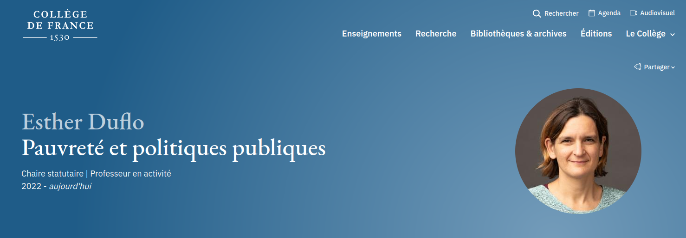
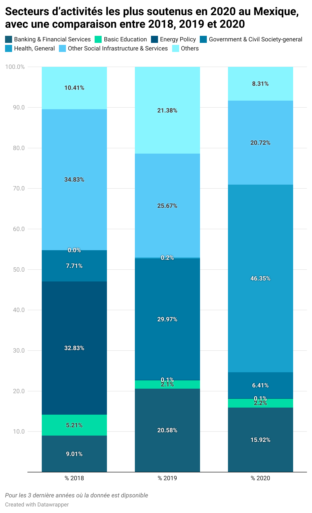

```{r, echo=FALSE}
library(metathis)
meta() %>% 
  meta_description(params$event) %>% 
  meta_name("github-repo" = paste0("datactivist/", params$slug)) %>% 
  meta_viewport() %>% 
  meta_social(
    title = params$title,
    url = paste0("https://datactivist.coop/", params$slug),
    image = params$image,
    image_alt = params$image_alt,
    og_type = "website",
    og_author = "Datactivist",
    og_locale = "fr_FR",
    og_site_name = "Datactivist",
    twitter_card_type = "summary",
    twitter_creator = "@datactivi_st")

```

layout: true

<style>
.remark-slide-number {
  position: inherit;
}

.remark-slide-number .progress-bar-container {
  position: absolute;
  bottom: 0;
  height: 4px;
  display: block;
  left: 0;
  right: 0;
}

.remark-slide-number .progress-bar {
  height: 100%;
  background-color: #e95459;
}

</style>


`r paste0("<div class='my-footer'><span>", params$event, "</span> <center><div class=logo><a href='https://datactivist.coop/'></a></div></center></span></div>")` 


---

class: center, middle

Ces slides en ligne : `r paste0("http://datactivist.coop/", params$slug)`

Sources : `r paste0("https://github.com/datactivist/", params$slug)`


Les productions de Datactivist sont librement réutilisables selon les termes de la licence [Creative Commons 4.0 BY-SA](https://creativecommons.org/licenses/by-sa/4.0/legalcode.fr).

<BR>
**Le contenu de ces diapositives provient du cours dispensé par [Cécile Le Guen](https://twitter.com/cecileLG) ces dernières années. Je la remercie chalheureusement !**

<BR>

.reduite[]

---

# Avant toute chose

> Il n'y a pas de question inutile.

--

> Il n'y a que des silence gênant.

---


.center[]


---


background-image: url(https://media.giphy.com/media/7zYMzl3AqmkDU7cXa9/giphy.gif)
class: inverse, center, top


# Présentations


---

## Présentation

* Sciences sociales et sciences politiques
* Sciences sociales et urbanisme (Berlin)
* Data dans des startups (Berlin)
* Master stratégies territoriales et urbaines
* Apprentissage
* Consultant open data et gouvernance des données 


---

## À vous !

1. Vous (notamment vous et votre année "hors-les-murs")
2. Votre futur vous
3. Vous et la data
4. Vous et ce cours
5. Vous et ce que vous voulez


---

## Les objectifs de ce cours

**Ce matin**
* Comprendre la place de la data dans les programmes de développement bilatéraux
* Comprendre la place de la data dans les programmes multilatéraux
* Comprendre l'utilité des données ouvertes dans les politiques de développement et la diplomatie
* Découvrir la gouvernance des données autour des données de l'ADP (standard international IATI, portail open data interministériel)

**Cet après-midi**
* Utiliser des données ouvertes pour appuyer une décision ou un plaidoyer
* S'approprier les phases de l'analyse de données : trouver, récupérer, nettoyer, traiter, présenter, etc...
* Effectuer des datavisualisations simples mais utilisables dans de nombreux contexte : cartographie, infographie

---

class: inverse, center, middle


# Les données : des enjeux de coopération internationale

---


## Les données, un enjeu de gouvernance


* **Les données, un élément-clé des politiques publiques de gouvernance**

Décentralisation, Fonction publique, Administration électronique, État-civil et identification des personnes, Gouvernement ouvert, ...

* **Les pôles Gouvernance des organisations internationales traitent de sujets liés aux données**

Élaborations des cadres de l'action publique et d'analyses comparatives, dialogue de politique sectorielle avec les autorités nationales et locales compétentes.

* **Les institutions publiques de coopérations internationales sont dans l’obligation de publier leur données de fonctionnement**

**Foreign Aid Transparency and Accountability Act / FATAA** : redevabilité et transparence pour les dépenses liées à l’aide publique au développement.

---

## Les données, un enjeu de développement


* **Départements “Data” crées au sein de tous les organismes de coopération**

Banque Mondiale, OCDE, ONU, mais aussi dans les ONG (TI, Amnesty, Greenpeace,..) ou UE (Parlement, Commission) et les bailleurs bilatéraux (USAID, DFID, GIZ, AFD, ...)

* **La donnée n’est pas un sujet uniquement technique ou statistique**

* **La donnée est devenue un enjeu de développement** 

* **Transports / Images satellites / Innovation économique / Santé / Éducation / Environnement / Urbanisme**

Mais aussi

* **Résilience, Lutte contre la corruption, Prévention des catastrophes, Droits Humains, Participation Citoyenne, Liberté d’expression**


---

class: inverse, center, middle


# Quelques exemples

---

## 1. Résilience climatique


.center[]

https://documents1.worldbank.org/curated/fr/134531592556070536/pdf/Open-Data-for-Resilience-Initiative-Planning-and-Open-Cities-Mapping-Project.pdf


---

## 2. Participation citoyenne

.center[]

https://bouba.mondoblog.org/2015/12/28/benin-vote-2016-les-blogueurs-du-benin-se-mobilisent-autour-de-lelection/

---

## 3. Transparence de l’action publique


.center[]


http://www.observatoire.td/

---

## 4. Coopération avec les média

Organisation indépendante créée en octobre 2012 par un ancien journaliste de l’AFP. Cette plateforme internet vise à lutter contre les fausses informations qui circulent dans les médias en Afrique et pouvant faire face au refus des institutions et administrations de répondre aux questions des journalistes.


.center[]


https://africacheck.org/fr


---

## 5. Piloter l'action publique par la donnée

.center[]

Les missions du CDCS

https://www.diplomatie.gouv.fr/fr/le-ministere-et-son-reseau/le-centre-de-crise-et-de-soutien/accompagner-les-operateurs-de-l-etat-et-les-entreprises/

---


## 6. Sécurité internationale


.center[]

https://www.radiofrance.fr/franceculture/twitter-etait-une-plateforme-de-choix-pour-les-djihadistes-7313518

---

### Deux notions reviennent souvent

.pull-left[
**Open Data**

"**Une donnée est ouverte si chacun peut librement y accéder, l'utiliser, la modifier et la rediffuser, quel que soit son but.** L'open data est aussi un mouvement. Il est aussi une politique publique consistant à ouvrir les données publiques de manière à favoriser l'innovation ouverte dans le secteur public, rendre des comptes aux citoyens et améliorer la transparence de l'action publique et enfin mettre à disposition du secteur privé des ressources permettant le développement de nouveaux services." 
[Contibuteur·rice·s Wikipedia](https://fr.wikipedia.org/wiki/Donn%C3%A9es_ouvertes#cite_note-GDT-1)

]


.pull-right[

**Gouvernement ouvert**

Principes

*Transparence dans la gestion des affaires publiques ;

*Redevabilité des élus dans la gestion des affaires publiques ;

*Diffusion d’informations essentielles à la compréhension et au suivi des politiques locales ;

*La participation citoyenne dans la décision, le suivi et l’évaluation de l’action publique.

]


---

## En France

.center[]


---


background-image: url(https://media.giphy.com/media/UTY42CoHu6wixtxTDh/giphy.gif)
class: inverse, center, top


# Pause

---

class: inverse, center, middle


# L'aide au développement est-elle efficace ?

---

## Ce que nous allons apprendre

* Différentes écoles de l’économie de l’Aide au Développement
* Comment mesurer l’efficacité de l’APD ?
* Découvrir le standard IATI et l’initiative portant le projet
* Découvrir les données
* Utiliser les données


---
## Définitions

**Aide publique au développement**

.pull-left[
> *Compte tenu des données de la pratique actuelle des transferts des fonds publics vers les pays sous-développés, la notion d'APD se définit comme un investissement hors marché fondé sur les objectifs que le bailleur de fonds entend poursuivre.* 

[Traore, Lanciné (2022).](https://tel.archives-ouvertes.fr/tel-03642909)

]


.pull-right[
> *L'ADP désigne d'une part un système international de transferts de ressources publiques qui met en contact des pays « donateurs » et des pays « bénéficiaires ». Il renvoie d'autre part à un agrégat statistique précis, objet de débats, conçu dans le but de mesurer l'activité de ce système.*

[Charnoz, Olivier, et Jean-Michel Severino (2015).](https://www.cairn.info/l-aide-publique-au-developpement--9782707182111-p-7.htm)

]

---
## Quelques chiffres

.center[]

.center[[OCED - Compare your country](https://www1.compareyourcountry.org/dev-coop-profiles-2022/en/1/all/default/all/OECD)]


---

## Trois écoles de pensée de l’économie du développement

**Ils et elles ont formulé différentes approches économiques du développement :**

* William Easterly
* Jeffrey Sachs
* Esther Duflo

---

## Les débats de l’économie de l’APD 

* L’APD représente des sommes non négligeables
* L’aide au développement existe depuis les années 50.

Selon William Easterly, elle a représenté une dépense d’environ 2300 milliards de dollars US entre 1950 et 1990. 

--

En 2022, le montant total de l'APD mondiale s'élevait autour de 169 milliards de dollars US. Source : [OCDE](https://www1.compareyourcountry.org/dev-coop-profiles-2022/en/0/4152+4153+4154+4155/default/all/20001) 

→ À partir des années 90, certains commencent à douter de l’efficacité de l’APD

---
## Contexte des années 90 pour l’APD

Les analyses d’évaluation de l’APD étaient alors extrêmement rares. 
On ne se posait pas vraiment la question de l’efficacité de l’aide. 

Changement assez important avec la chute du mur de Berlin et la réorientation des aides vers les pays de l’Est. 
Les premières questions commencent à se poser envers l’efficacité de l’aide aux pays les moins avancés, à travers : 
* L’impact sur l’investissement national 
* L’impact sur la croissance économique
* La réduction des dépenses publiques 

---
## Opposition de 2 figures : deux économistes américains 

1. **William Easterly**, le sceptique

* Économiste de la banque mondiale de 1985 à 2001
* Spécialiste des économies en voie de développement 
* Professeur à l’université de New-York

2. **Jeffrey Sachs**, l’optimiste

* Professeur à l’Université de Columbia
* Consultant auprès du secrétaire général de l’ONU
* Soutien intellectuel des grands plans de lutte contre la pauvreté
* Conseiller auprès de la Banque Mondiale, de l’OCDE ou de l’OMS 

---
## William Easterly

.pull-left[

Il pense qu’il ne sert à rien d’investir de l’argent dans des pays qui ont : 
* De mauvaises institutions 
* Dont la gouvernance n’est pas bonne
* Un excès de dépenses publiques 

Entre 1950 et 2001, les pays ayant reçu une aide inférieure à la moyenne ont connu des taux de croissance similaires à ceux qui ont reçu une aide étrangère supérieure à la moyenne. 

]

.pull-right[


[Easterly, William. 2007. The White Man’s Burden. London: Penguin Books.](https://fr.wikipedia.org/wiki/William_Easterly)

]

???

=> Des pays pauvres peuvent très bien s’en sortir sans cette aide. 
Exemple : la Corée du Sud. 

=> Ceux qui en ont bénéficié ne s’en sortent pas forcément mieux 

Difficulté à aménager l'aide (concrement`)


---

## Exemples

** Une compilation d'exemples de raté d'aides humanitaires par Sandrine Chastang **

> _Dans la région de Kayes, à l’ouest du Mali, arrivent quantité de médicaments envoyés par des associations d’immigrés originaires de la région, qui pensent ainsi aider leurs compatriotes. Or, de nombreux villageois pensent que ces médicaments vendus dans de belles boîtes venues de France sont plus efficaces que les génériques qui leur sont vendus par les centres de santé publique. Il arrive que les malades parcourent des kilomètres et dépensent tout leur revenu pour se procurer ces « belles boîtes », qui correspondent pourtant rarement aux prescriptions du médecin et portent préjudice au fonctionnement des centres de santé du Mali._

[Chastang, Sandrine. 2008. « Toutes les manières de rater un don humanitaire ». Revue du MAUSS 31 (1): 318‑47.](https://doi.org/10.3917/rdm.031.0318.)


---

## Jeffrey Sachs

.pull-left[

Il insiste sur les facteurs qui maintiennent les populations dans les "trappes à pauvreté" : 
* Soins insuffisants
* Malnutrition
* Revenus faibles
* Pas ou peu de formation, d’éducation

Son idée : il faut mener des projets ambitieux pour agir **simultanément** sur toutes les causes de la pauvreté, quelques soient les problèmes de gouvernance sur place. 

]

.pull-right[


[Sachs, Jeffrey. 2005. The end of poverty. New York: Penguin Press.](https://en.wikipedia.org/wiki/The_End_of_Poverty)
]

---
## Jeffrey Sachs

Il décide de mener son propre programme d’aide au développement : 
[Millenium Village Project](https://www.un.org/esa/coordination/Alliance/Earth%20Institute%20-%20The%20Millennium%20Villages%20Project.htm)

Objectif : Soutenir le développement d’une quinzaine de villages reculés en Afrique. 
Agir sur tous les facteurs de la pauvreté : donner le coup de _boost_ de départ. 

En 10 ans il a récolté 600 millions de USD$ pour financer son projet (avec des soutiens comme Bono ou Angelina Jolie). 


---

## Nina Munk, une analyse du projet de Jeffrey Sachs 

.pull-left[

Nina Munk, une journaliste a suivi son projet : elle s’est rendue régulièrement dans deux pays en Ouganda et au Kenya pour observer pendant 6 ans ce qu’il s’est passé sur place et suivre le projet de Jeffrey Sachs de près. 
Au Kenya où l’accès à eau question de survie et dans les Zones montagneuses de l’Ouganda. 

**_Takeaway_**

Faire très attention aux spécifités locales et toujours associer les usages aux données quantitatives.


]

.pull-right[

Écoutez son intervention dans le cadre du postcast **Splash** - dont s’est très largement inspirée cette première partie ;) 

_Entre 14:45-22:18._

.center[

[Nouvelles Écoutes - Splash](https://nouvellesecoutes.fr/podcast/splash/)
]
]

---

## Esther Duflo

.pull-left[

* Chercheuse au MIT
* Directrice du [J-PAL (Poverty Action Lab)](https://www.povertyactionlab.org/fr) 
* Conseillère de Barack Obama
* Assistante de recherche de Jeffrey Sachs

Elle a mis au point une méthode de travail permettant de rassembler des données précises sur l’efficacité de l’aide au développement : **mesurer l’efficacité de l’aide par des expérimentations aléatoires.**
]

.pull-right[


]

---

## Les _Randomized Controlled Trials (RCT)_

**Ou les expérimentations aléatoires.**

> _« Les RCT consistent à diviser aléatoirement une population en deux groupes. Le tirage au sort des deux sous-ensembles permet de les rendre comparables pour peu qu’il y ait suffisamment d’individus. À l’un, on donne alors un “traitement” (des manuels scolaires, des vaccins, des moustiquaires, des prêts à taux bonifié…), à l’autre, rien. Au bout d’un certain temps, on observe, à partir d’indicateurs chiffrés (résultats à des tests scolaires, prévalence d’une maladie, chiffre d’affaires, etc.), s’il existe des différences entre les deux groupes, ce qui doit permettre de quantifier l’impact du “traitement”._

[Jatteau, Arthur. 2016. « Faire preuve par le chiffre ? Le cas des expérimentations aléatoires en économie ». These de doctorat, Université Paris-Saclay (ComUE).](https://www.theses.fr/2016SACLN060)

???

À votre avis, pourquoi recourir à une telle méthode ?

---

## Les _Randomized Controlled Trials (RCT)_

.pull-left[


[Site du J-PAL](https://www.povertyactionlab.org/evaluation/farmers-and-fear-crime-improving-agricultural-productivity-through-farm-protection-kenya)
]

.pull-right[


[Dyer, Julian. 2022. « The Fruits (and Vegetables) of Crime ». SSRN Electronic Journal.](https://www.povertyactionlab.org/sites/default/files/research-paper/Farm%20Theft%20and%20Social%20Relationships%20Evidence%20from%20Maasai%20Farm%20Watchmen.pdf)

]

---

## Esther Duflo : chaire statutaire du Collège de France 2022-2023


[Site du Collège de France](https://www.college-de-france.fr/chaire/esther-duflo-pauvrete-et-politiques-publiques-chaire-statutaire)

---

## Conclusion

Pour bâtir des théories économiques et des méthodes empiriques, une des clés est de s’appuyer sur des données et des informations qui seraient :
* FIABLES
* RÉGULIÈRES
* STANDARDISÉES
* COMPARABLES 

---

## Petit exercice

[Cliquez ici.](https://www1.compareyourcountry.org/dev-coop-profiles-2022/en/0//default/all/4)

.pull-left[

À propos de la [Loi du 4 août 2021 de programmation relatif au développement solidaire et à la lutte contre les inégalités mondiales](https://www.vie-publique.fr/loi/277797-loi-4-aout-2021-programmation-aide-publique-developpement-solidaire)

La Loi prévoit de orter l'APD de 0,37% en 2017 à 0,55% en 2022.

**1. Cela est-il été suivi d'effets ?**

]

.pull-right[


[Écoutez les propos de Najat Vallaud-Belkacem](https://www.radiofrance.fr/franceculture/podcasts/politique/najat-vallaud-belkacem-il-faut-repenser-l-aide-publique-au-developpement-9433731)


Directrice générale France de [ONE](https://fr.wikipedia.org/wiki/Campagne_ONE) (ONG de plaidoyer en partenariat avec plusieurs ONG humanitaires).

> *"Environ 20% sert à financer l'acceuil des réfugiés sur le territoire, soit les frais de santé des demandeurs d'asile et les bourses des étudiants demandeurs d'asile."*

**2. As-t-elle raison ?**


*7 minutes 30 - 8 minutes 55*

]


---

background-image: url(https://media.giphy.com/media/UTY42CoHu6wixtxTDh/giphy.gif)
class: inverse, center, top


# Pause

---

class: inverse, center, middle

# Données de l’aide internationale disponibles en open data : le standard _IATI_

---

class: center, middle

## IATI = _International Aid Transparency Initiative_

---

## Histoire de l’IATI


**Forum de Haut Niveau d’Accra 2008 - Programme d’action d’Accra Para. 24a et 26b**
- “Diffuser publiquement des informations régulières, détaillées et opportunes sur le volume, les affectations et les résultats...”
- “Fournir des informations régulières et opportunes sur les dépenses prévisionnelles et les plans de mise en œuvre...”

**Busan 2011 - Déclaration de Busan pour l’efficacité de l’aide :**
- “Mettre en œuvre une norme commune, ouverte, en vue de la publication électronique d’informations opportunes, complètes et orientées vers l’avenir sur les ressources fournies grâce à la coopération pour le développement...”

---
## Principes de l’IATI

* Rendre l’information sur l’aide publique et privée plus disponible et accessible.
* Avoir un fort engagement institutionnel (engager les bailleurs de fonds, et les pays partenaires) 
* Une initiative d’innovation technologique (développement de formats électroniques communs pour permettre l'échange automatique de données) 

Il est attendu des signataires de l’IATI qu’ils respectent leurs engagements dans le respect des règles, et au profit des bailleurs comme des pays bénéficiaires. 

---

## Une initiative pour la transparence de l’aide

Le standard IATI a été construit en 2008 sur la base du système de déclaration statistique de l’OCDE, le Credit Reporting System (CRS).
 
* Avant IATI, le seul système rassemblant des informations sur les données de l’aide internationale était cet outil.
* L’information n’était pas à jour (un à deux ans de décalage) des délais considérés comme trop longs pour le pilotage de projets
* Le standard IATI n’est pas aussi exhaustif

Une initiative multi-partite financée par les bailleurs et les États. 

La gouvernance est importante : pas de standard de données sans [gouvernance](https://iatistandard.org/fr/governance/) propre et propre.

---
class: center, middle


https://www.youtube.com/watch?v=PbwIUQwL_Jc

---

## Une initiative qui rassemble

**1496 organisations qui publient à ce jour**

Ce nombre augmente tous les ans
(Source : https://www.iatiregistry.org)

**Des données à jour**

96% des éditeurs mettent à jour leurs données au moin´s chaque trimestre

**Des données disponibles**

Au moins 9 des 10 pays les plus développés publient leur données

---

## Qui publie les données ?

**Les agences gouvernementales ou Ministères** 

State Department, Ministère des Affaires Étrangères

**Les bailleurs bilatéraux**

USAID, l’AFD, DFID, SIDA, GIZ, etc..

**Les bailleurs multilatéraux**

Agences de l’ONU, Commission Européenne 

**Les fondations privées**

Gates Foundation

**Les ONGs**

Oxfam, Save the Children

---

## Des données réparties en deux fichiers

**1. Des données de niveau stratégique et général : le fichier Organisation**

* Budgets organisationnels
* Budgets nationaux
* Information stratégique

**2. Des données au niveau opérationnel et local**

* Documents au niveau des activités
* Budgets des projets et des transactions
* Informations des agences locales sur l’exécution
* Résultats des activités

---

## Un portail unique : d-portal


http://d-portal.org


---


## Petit exercice

### Parcourir les données opérationnelles

Sur D-Portal, sélectionnez : 

RECIPIENT COUNTRY : Colombia
PUBLISHER : Agence Française de Développement
YEAR : 2022

→ Question : En quelle année débute le "Femmes du Monde : un réseau pour les autonomies sociale, politique et économique des femmes des quartiers populaires aux Suds et aux Nords" ?

→ Qui est le partenaire local de mise en oeuvre ? Pour le compte de quel pays ? Via quelle organisation ? (implementing partner) 

→ Combien de pays receveurs font partie du projet ? 

---

class: inverse, center, middle

# Quelles sont les (autres) informations publiées dans le standard IATI ? 

---

## Données géographiques


---

## Données financières


---

## Classification des données


---

class: inverse, center, middle

# Un index pour mesurer la performance de la transparence

---

## L'index : une expertise société civile

**L’index de la Transparence de l’Aide**

L’ONG “Publish What You Fund” ( PWYF ) publie chaque année un classement des bailleurs de fonds suivant plusieurs critères, dont la qualité des données publiées avec le standard IATI. 


Parmi les autres critères : 
* pertinence de la loi d’accès à l’information pour l’aide internationale, 
* publication de rapport annuel, 
* de documents de budgets, 
* d’évaluation, etc.


---

# Le classement 2022


https://www.publishwhatyoufund.org/the-index/2022/

---
## La France classée 28 sur 50

En France, deux institutions se chargent de publier des données : 

**1. L’AFD**

L’AFD a publié des données dans le registre de l’IITA selon une base mensuelle et a amélioré sa fréquence de publication depuis l’Indice 2018. Son classement s’est nettement améliorée depuis 2018, en augmentant sa note de 12 points.
https://www.publishwhatyoufund.org/the-index/2020/francaise-afd/ 

**2. Le Ministère de l’Europe et des Affaires Étrangères**

Le MEAE fournit ou fait des crédits des aides aux projets, des aides budgétaires et une assistance technique. Le Ministère a amélioré la fréquence de publication, passant de moins d’une fois par trimestre en 2016 à une fois par mois en 2018.
https://www.publishwhatyoufund.org/the-index/2020/francaise-meae/ 

---

**Les banques, les anglo-saxons**

1. AfDB : Banque Africaine de Développement 
2. World Bank-IDA : International Development Association
3. IADB: Inter-American Development Bank 
4. AsDB : Banque Asiatique de Développement
5. US-MCC : Millennium Challenge Corporation (MCC) is an independent bilateral US foreign aid agency, created by the US Congress in 2004 
6. UNICEF
7. UNDP : United Nations Development Program

---

class: inverse, center, top

background-image: url(https://media.giphy.com/media/vdbrUjzrUEGly/giphy.gif)


# À table ! Rendez-vous à 13h30 !


---

.center[]


---

class: inverse, center, middle

# Initiation au travail avec les données 

---

## Programme de cette après-midi

**Un peu de cartographie !**

* Rappel de vos enseignements sur les données
* Exporter les données (en .csv, excel..)
* Traiter les données (petites opérations) 
* Datavisualisation : cartographie, infographie

**Rappel des objectifs**

* Utiliser des données ouvertes pour appuyer une décision ou un plaidoyer
* S'approprier les phases de l'analyse de données : trouver, récupérer, nettoyer, traiter, présenter, etc...
* Effectuer des datavisualisations simples mais utilisables dans de nombreux contexte : cartographie, infographie

---
## Module [“Culture générale des données”](https://datactivist.coop/SPoSGL/)

* Section 1 : Qu’est-ce qu’une donnée ? Petite histoire sociale des données et de leur exploitation
* Section 2 : La datafication ou les promesses de la mise en données du monde
* Section 3 : Données, données… quelles données ? Les différents types de données
* Section 4 : L’écosystème des sources de données publiques
* Section 5 : Manipulation et représentation de données, éviter des écueils classiques
* Section 6 : Open Data et Gouvernement ouvert
* Section 7 : Créer de la valeur à partir des données publiques
* Section 8 : Le cadre juridique autour de l’open data et de la protection des données personnelles
* Section 9 : Qu’est-ce que la data science ?
* Section 10 : Analyse, modélisation, machine learning et algorithmes

???

Rappel section 3

---
class: inverse, center, middle

# Exercice 1


---

## Mise en situation

.pull-left[

Vous effectuez un stage de fin d'étude à **l'Ambassade de France en Argentine**. Votre supérieur vous informe que le·a directeur·rice Argentine de l'AFD va changer et que la nouvelle personne en poste va rapidemment prendre contact avec l'ambassadrice (Claudia Scherer-Effosse). 
**Vous êtes chargé·e de réaliser une note, appuyée sur des données sur l'action de l'AFD en Amérique du Sud.**

**Pour cela, il vous faudra réaliser cette carte : **

*Les valeurs correspondent à la moyenne des engagements bruts en millions Euros *

]

.pull-right[


[Accédez à la carte](https://www.datawrapper.de/_/0etKH/)

]

---

## Une méthode pas-à-pas


.pull-left[

Valable pour tout type de projet, de la brève sur le vote du budget municipal à l’enquête internationale sur l’évasion fiscale.

**UN TRAVAIL SOUVENT NON LINEAIRE** : Aller-retour entre étapes, répétition des étapes pour plusieurs jeux de données…


]

.pull-right[


]

---
## Une méthode pas-à-pas

.pull-right[


]

---

## Deux questions principales à se poser

→ Où se trouvent les données ?

→ Sous quel format sont-elles conservées ?


---
## Ce qui implique le format des données

→ D’où la nécessité des données disponibles de façon la plus brute possible


---

## S’organiser : quelques règles simples

**→ Ne jamais travailler sur le fichier original, toujours sur une copie**

→ Faire des copies à chaque grande étape de la transformation du fichier. Une erreur doit être facilement réparable.

→ s’assurer d’avoir des copies de sauvegarde pour tous les fichiers de travail. Hors ligne (disque dur externe) ou en ligne (Dropbox, Google Drive, Github...).

→ prendre en note les étapes de votre méthodologie, afin de pouvoir facilement revenir sur un projet ou de les partager avec des collègues absents

---

## Les 3 étapes du nettoyage de données

**1. Le toilettage :** à cheval entre la vérification et le nettoyage, permet de faire des analyses simples (tri, visualisations…). Seule la forme des données est touchée.

*Par ex : Tableaux croisés dynamiques pour faire des analyses rapides*

**2. L’édition :** ne garder que les données pertinentes pour l’analyse, et corriger les éventuels problèmes de contenu.

*Par ex : enlever certaines colonnes d’un jeu de données etc*

**3. Le rapprochement : **associer plusieurs jeux de données si nécessaire afin d’avoir un jeu de données plus complet. Peut nécessiter de refaire toute la pipeline de données.

*Par ex : faire une carte des projets de coopération français en associant les 3 jeux de données du MEAE, de l’AFD et de Proparco*

---
## Rappel : mise en situation

.pull-left[

Vous effectuez un stage de fin d'étude à **l'Ambassade de France en Argentine**. Votre supérieur vous informe que le·a directeur·rice Argentine de l'AFD va changer et que la nouvelle personne en poste va rapidemment prendre contact avec l'ambassadrice (Claudia Scherer-Effosse). 
**Vous êtes chargé·e de réaliser une note, appuyée sur des données sur l'action de l'AFD en Amérique du Sud.**

**Pour cela, il vous faudra réaliser cette carte : **

*Les valeurs correspondent à la moyenne des engagements bruts en millions Euros *

]

.pull-right[


[Accédez à la carte](https://www.datawrapper.de/_/0etKH/)

]

---

## Les étapes de l'exercice (1)

**1. Aller sur le portail open data de l’AFD**

https://opendata.afd.fr/page/accueil/

**2. Aller dans l’onglet “Données”**

et en particulier trouver le jeu de données “Données de l'aide au développement de l'AFD” 

**3. Aller dans l’onglet “tableau” pour avoir un aperçu des données**

https://opendata.afd.fr/explore/dataset/donnees-aide-au-developpement-afd/table/?disjunctive.pays_de_realisation

**→ Que lit-on ?**


---

## Les étapes de l'exercice (2)

**4. Regarder les filtres disponibles :**

* Etat du projet : Exécution / Achevé
* Pays de réalisation
* Région : Amériques
* Libellé CICID 

**5. Aller dans EXPORT**

https://opendata.afd.fr/explore/dataset/donnees-aide-au-developpement-afd/export/?disjunctive.pays_de_realisation&refine.region=Am%C3%A9riques

**6. Télécharger au format .csv sur votre sélection**

---
## Les étapes de l'exercice (3)

**7. Ouvrir le fichier dans un tableau**

Google Spreadsheets ou Excel. Psst : https://fr.wikihow.com/ouvrir-un-fichier-CSV 

**8. Bien observer les colonnes de données requises pour faire une carte**

-> Pays de réalisation
-> Montant

---

## Les étapes de l'exercice (4)

**9. Dans tous les cas, la première étape consiste à grouper les projets par pays**

Il faut passer d’un fichier avec une ligne par projet à un fichier qui regroupe les projets par pays

→ On utilise pour ça un tableau croisé dynamique (*Pivot table*)

Psst : https://fr.wikihow.com/cr%C3%A9er-un-tableau-crois%C3%A9-dynamique-sous-Excel

---

class: center, middle


**Ce qu'on veux obtenir**

---

## Les étapes de l'exercice (5)

**Configuration du tableau croisé dynamique**

**Lignes :** Pays de réalisation 

**Valeurs :** AVERAGE des Engagements bruts 

**10. Se connecter à**

https://www.datawrapper.de/ 

---

## Les étapes de l'exercice (6)

**11. Sélectionner la partie création de cartes**


---
## Les étapes de l'exercice (7)

.pull-left[

Datawrapper a besoin d'un tableau avec au moins deux colonnes :
**Names** et **value**

Le géocodage de chaque région que vous souhaitez remplir d'une couleur. Le plus souvent, c'est le nom ou les données de géolocalisation.

Chaque carte aura des géocodes spécifiques et il est préférable de vérifier lesquels sont acceptés au début de votre processus de préparation des données.

[Lien d'aide](https://academy.datawrapper.de/article/115-how-to-import-data-choropleth-map)

]

.pull-right[


]

---

class: inverse, center, middle

# Exercices 2 et 3 (BONUS)


---

## Exercice 2

#### Avec les données IATI

.center[]

---

## Exercice 3

#### 5 secteurs d’activités principalement soutenus au Mexique les 3 dernières années

.center[]

---
## Mise en situation finale

#### Vous êtes chargé de plaidoyer chez Amnesty International


Vous devez rédiger un argumentaire pour nourrir une campagne qui visera à **informer le public sur les ventes illégales d’armes françaises** afin d'obtenir la mise en place d’un contrôle sur ce commerce.


Argumentaire : 

> *Nous ne disons pas que toutes les exportations d’armes françaises sont illégales ou que la France fait n’importe quoi tout le temps, mais dans certains cas comme l’Égypte, ou le Yémen, la France ne respecte pas le droit international.*

https://www.amnesty.fr/controle-des-armes 

**Objectiver : **

Pour le prouver, vous devez trouver le montant et le type d’armement exporté par la France au Yémen et au Liban.


---

class: inverse, center, middle

# Questions ?

Contact : [clement@datactivist.coop](mailto:clement@datactivist.coop)